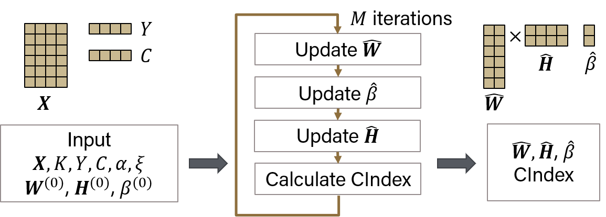
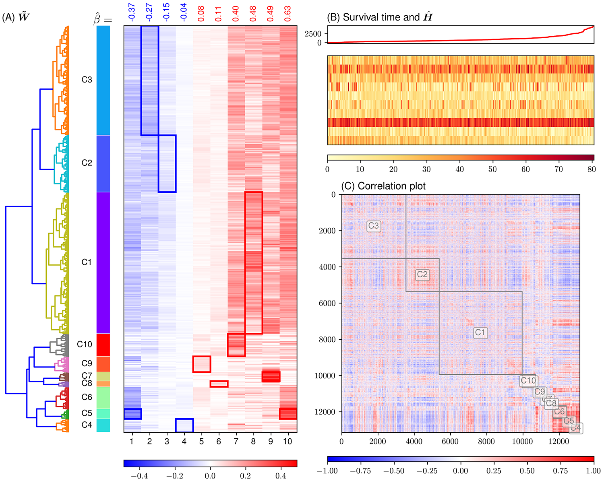

# CoxNMF

Huang <em>et al.</em> CoxNMF: A Proportional Hazards Non-negative Matrix Factorization Method for Identifying Survival Associated Gene Clusters.

[](https://github.com/huangzhii/CoxNMF/blob/master/LICENSE)

## Introduction

<div style="text-align:center"></div>

In this work, Cox proportional hazards regression is integrated with NMF by imposing survival constraints. This is accomplished by jointly optimizing the Frobenius norm and partial log likelihood for events such as death or relapse. Simulation results on synthetic data demonstrated the superiority of the proposed method, when compared to other algorithms, in finding survival associated gene clusters. In addition, using human cancer gene expression data, the proposed technique can unravel critical clusters of cancer genes. The discovered gene clusters reflect rich biological implications and can help identify survival-related biomarkers. Towards the goal of precision health and cancer treatments, the proposed algorithm can help understand and interpret high-dimensional heterogeneous genomics data with accurate identification of survival-associated gene clusters.

## Getting start

For simulation experiments, run

```bash
python main.py --dataset simulation
```

For TCGA cancer experiments, run

```bash
python main.py --dataset TCGA
```
and use argparse to parse in the parameters.

Alternatively, gen_bash.py script can help you to generate multiple commands and run in parallelSunday, 07. March 2021 09:35PM 
Sunday, 07. March 2021 09:35PM 
.

## Python packages version

* Python 3.8.3
* lifelines 0.25.4
* numpy 1.18.5
* pandas 1.0.5
* matplotlib 3.3.2
* sklearn 0.23.2
* scipy 1.5.0
* searborn 0.11.0
* tqdm 4.47.0

## Example cancer result: COAD

For Colon adenocarcinoma (COAD), we have P=13,140 genes, and N=298 samples. We found K=10 returns highest silhouette score. The optimization returns C-Index =1.0, relative error = 8.8071%. Results were shown in the following figure.

<div style="text-align:center"></div>